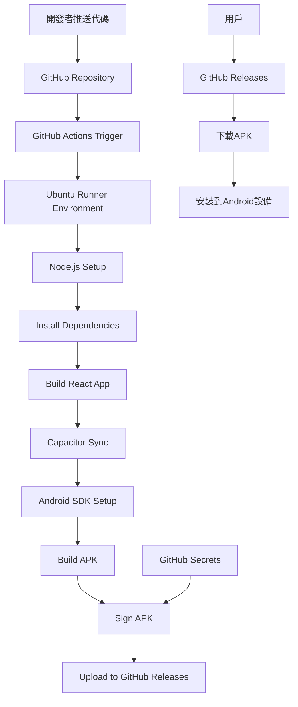

# GitHub雲端APK構建與分發系統設計文檔

## 概述

本設計文檔描述了基於GitHub Actions的完全雲端APK構建與分發系統。該系統將現有的React Web應用通過Capacitor框架打包成Android APK，並通過GitHub的CI/CD服務實現自動化構建、簽名和分發。

## 架構

### 系統架構圖



### 核心組件

1. **GitHub Actions Workflow** - 自動化構建流程
2. **Android Build Environment** - 雲端Android SDK環境
3. **Capacitor Integration** - Web到Native的橋接
4. **Signing System** - APK簽名管理
5. **Release Management** - 版本發布和分發
6. **Update Checker** - 應用內更新檢查

## 組件和接口

### 1. GitHub Actions Workflow

**文件位置**: `.github/workflows/build-apk.yml`

**主要功能**:
- 觸發條件：推送到main分支、創建標籤、手動觸發
- 環境設置：Node.js、Java、Android SDK
- 構建流程：React構建 → Capacitor同步 → APK生成
- 簽名和發布：使用GitHub Secrets簽名並上傳到Releases

**接口**:
```yaml
# 輸入參數
inputs:
  release_type: # 'release' 或 'debug'
  version_name: # 版本名稱（可選）
  
# 輸出產物
outputs:
  apk_path: # 生成的APK文件路徑
  version_code: # 自動生成的版本代碼
```

### 2. Capacitor配置管理

**文件位置**: `client/capacitor.config.ts`

**配置項**:
```typescript
interface CapacitorConfig {
  appId: string;           // 'com.smartwardrobe.app'
  appName: string;         // '智能衣櫥'
  webDir: string;          // 'build'
  server: {
    androidScheme: string; // 'https'
  };
  plugins: {
    Camera: CameraConfig;
    Storage: StorageConfig;
  };
}
```

### 3. 簽名配置系統

**GitHub Secrets配置**:
```
ANDROID_KEYSTORE_BASE64: # Base64編碼的keystore文件
ANDROID_KEYSTORE_PASSWORD: # keystore密碼
ANDROID_KEY_ALIAS: # 密鑰別名
ANDROID_KEY_PASSWORD: # 密鑰密碼
```

**簽名腳本**: `scripts/sign-apk.js`
```javascript
interface SigningConfig {
  keystorePath: string;
  keystorePassword: string;
  keyAlias: string;
  keyPassword: string;
}
```

### 4. 版本管理系統

**版本策略**:
- **版本名稱**: 基於Git標籤 (如 v1.0.0) 或日期 (如 2024.01.15)
- **版本代碼**: 基於Git commit數量自動遞增
- **構建號**: GitHub Actions運行編號

**版本配置文件**: `version.json`
```json
{
  "versionName": "1.0.0",
  "versionCode": 1,
  "buildNumber": "${GITHUB_RUN_NUMBER}",
  "gitCommit": "${GITHUB_SHA}",
  "buildDate": "${BUILD_DATE}"
}
```

### 5. 更新檢查服務

**API端點**: GitHub Releases API
```
GET https://api.github.com/repos/{owner}/{repo}/releases/latest
```

**應用內更新檢查**: `src/services/updateChecker.js`
```javascript
interface UpdateInfo {
  hasUpdate: boolean;
  latestVersion: string;
  downloadUrl: string;
  releaseNotes: string;
}
```

## 數據模型

### 1. 構建配置模型

```javascript
interface BuildConfig {
  projectName: string;
  appId: string;
  appName: string;
  version: {
    name: string;
    code: number;
  };
  signing: {
    enabled: boolean;
    keystoreConfig: SigningConfig;
  };
  build: {
    type: 'debug' | 'release';
    minSdkVersion: number;
    targetSdkVersion: number;
    compileSdkVersion: number;
  };
}
```

### 2. 發布信息模型

```javascript
interface ReleaseInfo {
  tagName: string;
  name: string;
  body: string;
  draft: boolean;
  prerelease: boolean;
  assets: Array<{
    name: string;
    downloadUrl: string;
    size: number;
    contentType: string;
  }>;
}
```

### 3. 構建報告模型

```javascript
interface BuildReport {
  buildId: string;
  status: 'success' | 'failure' | 'cancelled';
  startTime: Date;
  endTime: Date;
  duration: number;
  apkSize: number;
  version: {
    name: string;
    code: number;
  };
  errors: string[];
  warnings: string[];
}
```

## 錯誤處理

### 1. 構建錯誤處理

**常見錯誤類型**:
- 依賴安裝失敗
- React構建失敗
- Capacitor同步失敗
- Android SDK問題
- 簽名失敗

**錯誤處理策略**:
```javascript
class BuildErrorHandler {
  handleDependencyError(error) {
    // 清理緩存並重試
    // 提供具體的修復建議
  }
  
  handleSigningError(error) {
    // 驗證GitHub Secrets配置
    // 提供keystore重新生成指南
  }
  
  handleCapacitorError(error) {
    // 檢查capacitor.config.ts
    // 驗證Android項目結構
  }
}
```

### 2. 運行時錯誤處理

**APK運行時錯誤**:
- 網絡連接問題
- 權限請求失敗
- 存儲空間不足
- 相機訪問失敗

**錯誤恢復機制**:
```javascript
class RuntimeErrorHandler {
  handleNetworkError() {
    // 啟用離線模式
    // 顯示網絡狀態指示
  }
  
  handlePermissionError() {
    // 顯示權限請求說明
    // 提供設置頁面鏈接
  }
}
```

## 測試策略

### 1. 構建測試

**GitHub Actions測試階段**:
```yaml
test:
  runs-on: ubuntu-latest
  steps:
    - name: Unit Tests
      run: npm test
    
    - name: Build Test
      run: npm run build
    
    - name: APK Validation
      run: |
        aapt dump badging app-release.apk
        apksigner verify app-release.apk
```

### 2. APK功能測試

**自動化測試**:
- APK安裝測試
- 基本功能驗證
- 權限檢查
- 性能基準測試

**測試腳本**: `scripts/test-apk.js`
```javascript
class APKTester {
  async testInstallation(apkPath) {
    // 使用Android模擬器測試安裝
  }
  
  async testBasicFunctions() {
    // 測試應用啟動和核心功能
  }
  
  async testPermissions() {
    // 驗證相機、存儲等權限
  }
}
```

### 3. 集成測試

**端到端測試流程**:
1. 代碼推送觸發構建
2. APK生成和簽名
3. 上傳到GitHub Releases
4. 下載和安裝驗證
5. 應用功能測試

## 安全考慮

### 1. 簽名安全

**最佳實踐**:
- 使用GitHub Secrets存儲敏感信息
- keystore文件Base64編碼存儲
- 定期輪換簽名密鑰
- 限制GitHub Actions權限

### 2. 分發安全

**安全措施**:
- APK簽名驗證
- GitHub Releases訪問控制
- 下載鏈接完整性檢查
- 惡意軟件掃描集成

### 3. 更新安全

**安全更新機制**:
- HTTPS API調用
- 簽名驗證
- 版本回滾機制
- 安全補丁優先級

## 性能優化

### 1. 構建性能

**優化策略**:
- GitHub Actions緩存
- 並行構建步驟
- 增量構建
- 資源預分配

**緩存配置**:
```yaml
- name: Cache Node modules
  uses: actions/cache@v3
  with:
    path: ~/.npm
    key: ${{ runner.os }}-node-${{ hashFiles('**/package-lock.json') }}

- name: Cache Gradle
  uses: actions/cache@v3
  with:
    path: ~/.gradle/caches
    key: ${{ runner.os }}-gradle-${{ hashFiles('**/*.gradle*') }}
```

### 2. APK大小優化

**優化技術**:
- 代碼分割和懶加載
- 資源壓縮
- ProGuard/R8混淆
- 未使用資源移除

**構建配置**:
```gradle
android {
  buildTypes {
    release {
      minifyEnabled true
      shrinkResources true
      proguardFiles getDefaultProguardFile('proguard-android-optimize.txt')
    }
  }
}
```

### 3. 下載性能

**優化措施**:
- APK壓縮
- CDN分發（GitHub Releases）
- 增量更新支持
- 斷點續傳

## 部署和維護

### 1. 初始設置

**設置步驟**:
1. 創建GitHub Secrets
2. 配置workflow文件
3. 生成簽名密鑰
4. 測試構建流程

**設置腳本**: `scripts/setup-github-actions.js`
```javascript
class GitHubActionsSetup {
  async generateKeystore() {
    // 生成新的keystore文件
  }
  
  async setupSecrets() {
    // 配置GitHub Secrets指南
  }
  
  async validateSetup() {
    // 驗證配置完整性
  }
}
```

### 2. 監控和日誌

**監控指標**:
- 構建成功率
- 構建時間
- APK下載量
- 用戶反饋

**日誌管理**:
- GitHub Actions日誌
- 應用內錯誤日誌
- 性能監控數據
- 用戶行為分析

### 3. 維護任務

**定期維護**:
- 依賴更新
- 安全補丁
- 性能優化
- 用戶反饋處理

**自動化維護**:
```yaml
# 定期依賴更新
- name: Update Dependencies
  uses: ./.github/workflows/update-deps.yml
  schedule:
    - cron: '0 0 * * 1'  # 每週一執行
```

## 文檔和支持

### 1. 用戶文檔

**文檔結構**:
- APK下載和安裝指南
- 常見問題解答
- 故障排除指南
- 更新說明

### 2. 開發者文檔

**技術文檔**:
- GitHub Actions配置指南
- 簽名設置教程
- 自定義構建選項
- API參考文檔

### 3. 支持渠道

**支持方式**:
- GitHub Issues
- 文檔網站
- 社群論壇
- 技術支持郵箱