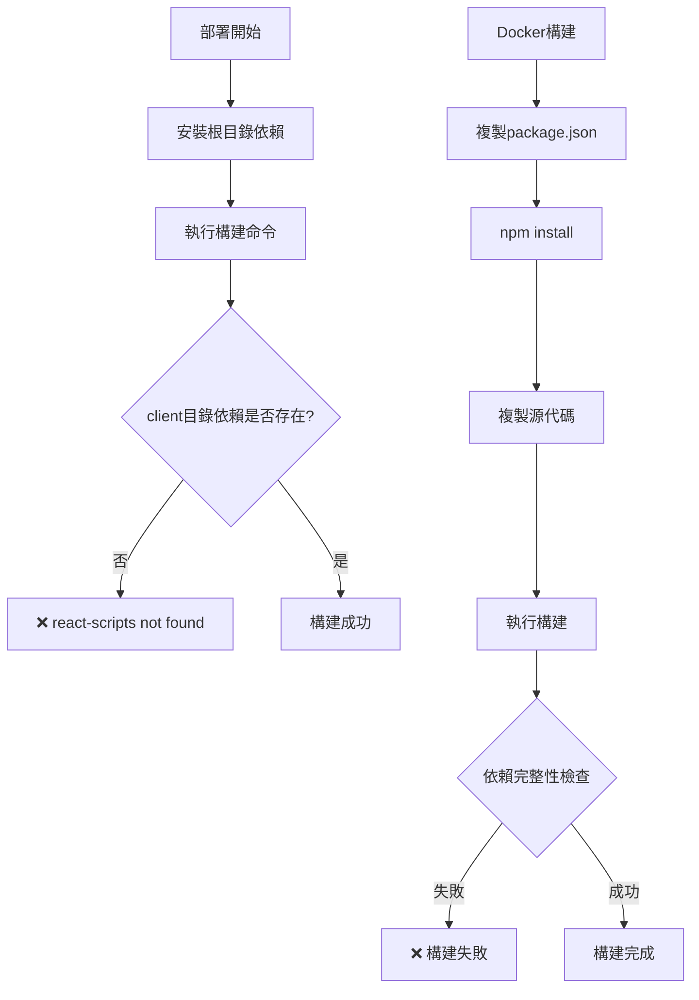
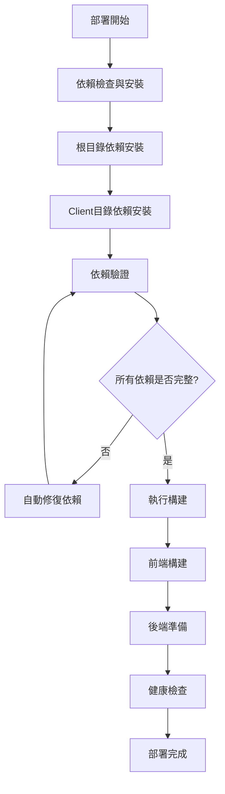

# 部署構建修復設計文件

## 概述

本設計旨在解決智能衣櫥應用在部署過程中遇到的 `react-scripts: not found` 錯誤和其他構建問題。通過分析當前的構建流程，我們發現主要問題在於：

1. 多目錄結構的依賴管理不當
2. Docker 構建過程中的依賴安裝順序問題
3. 不同部署平台的構建配置不一致
4. 缺乏構建過程的錯誤處理和診斷

## 架構

### 當前問題分析



### 修復後的架構



## 組件和接口

### 1. 構建管理器 (BuildManager)

負責協調整個構建過程：

```javascript
class BuildManager {
  async validateDependencies()
  async installDependencies()
  async buildClient()
  async buildServer()
  async healthCheck()
}
```

### 2. 依賴檢查器 (DependencyChecker)

檢查和驗證項目依賴：

```javascript
class DependencyChecker {
  async checkRootDependencies()
  async checkClientDependencies()
  async validateReactScripts()
  async fixMissingDependencies()
}
```

### 3. 平台適配器 (PlatformAdapter)

為不同部署平台提供適配：

```javascript
class PlatformAdapter {
  async getZeaburConfig()
  async getDockerConfig()
  async getLocalConfig()
  async adaptBuildProcess(platform)
}
```

## 數據模型

### 構建配置模型

```typescript
interface BuildConfig {
  platform: 'zeabur' | 'docker' | 'local'
  rootDir: string
  clientDir: string
  dependencies: {
    root: string[]
    client: string[]
  }
  buildCommands: {
    install: string[]
    build: string[]
    start: string
  }
  environment: Record<string, string>
}
```

### 依賴檢查結果模型

```typescript
interface DependencyCheckResult {
  isValid: boolean
  missing: string[]
  outdated: string[]
  conflicts: string[]
  recommendations: string[]
}
```

## 錯誤處理

### 1. 依賴錯誤處理

```javascript
class DependencyErrorHandler {
  handleMissingReactScripts() {
    // 自動安裝 react-scripts
    // 驗證版本兼容性
    // 更新 package.json
  }
  
  handleVersionConflicts() {
    // 解析版本衝突
    // 提供升級建議
    // 自動修復兼容版本
  }
}
```

### 2. 構建錯誤處理

```javascript
class BuildErrorHandler {
  handleBuildFailure(error) {
    // 分析錯誤類型
    // 提供修復建議
    // 自動重試機制
  }
  
  handleTimeoutError() {
    // 增加構建超時時間
    // 優化構建過程
    // 提供進度反饋
  }
}
```

## 測試策略

### 1. 單元測試

- 依賴檢查器功能測試
- 構建管理器各階段測試
- 錯誤處理邏輯測試
- 平台適配器配置測試

### 2. 集成測試

- 完整構建流程測試
- 多平台部署測試
- 依賴修復流程測試
- 錯誤恢復機制測試

### 3. 端到端測試

- 本地開發環境構建測試
- Docker 容器構建測試
- Zeabur 部署流程測試
- 構建產物功能驗證測試

### 測試環境配置

```yaml
test_environments:
  local:
    node_version: "18.x"
    npm_version: "9.x"
    dependencies: "clean_install"
  
  docker:
    base_image: "node:18-alpine"
    build_stages: ["builder", "production"]
    health_check: true
  
  zeabur:
    platform: "nodejs"
    build_command: "npm run build"
    start_command: "npm start"
```

## 實施計劃

### 階段 1：依賴管理修復
- 修復 package.json 構建腳本
- 實現自動依賴檢查
- 添加依賴修復機制

### 階段 2：Docker 構建優化
- 優化 Dockerfile 多階段構建
- 改進依賴安裝順序
- 添加構建緩存策略

### 階段 3：平台適配
- 統一不同平台的構建配置
- 實現平台特定的優化
- 添加部署驗證機制

### 階段 4：監控和診斷
- 添加構建過程監控
- 實現詳細的錯誤診斷
- 提供構建性能分析

## 性能考慮

### 構建優化策略

1. **依賴緩存**：利用 npm 緩存減少安裝時間
2. **並行構建**：前端和後端構建並行執行
3. **增量構建**：只重建變更的部分
4. **資源優化**：優化 Docker 層級和文件複製

### 監控指標

- 構建時間
- 依賴安裝時間
- 錯誤率
- 成功部署率
- 資源使用情況