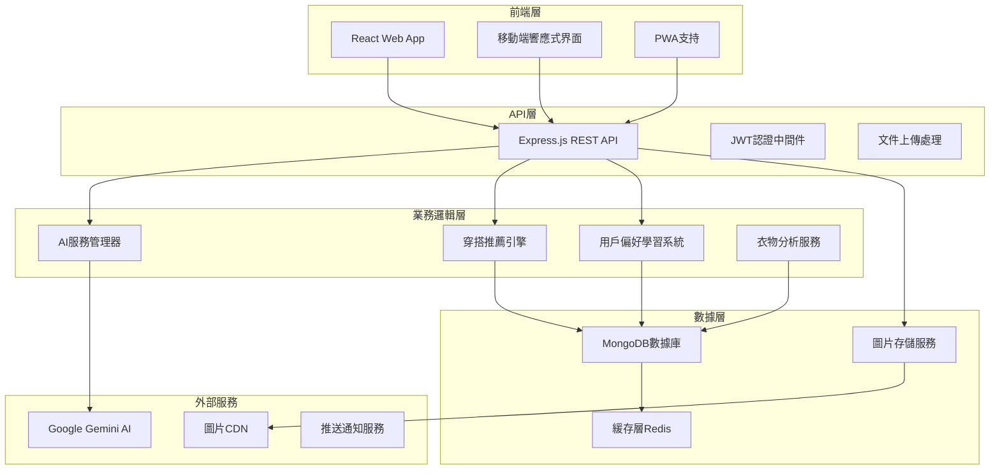

# 智能衣櫃管理APP設計文檔

## 概覽

智能衣櫃管理APP是一個專為ADHD用戶設計的衣物管理系統，通過Google Gemini AI提供智能識別、分類和穿搭推薦功能。系統採用現代化的Web技術棧，提供簡潔直觀的用戶界面，減少認知負荷，幫助用戶更好地管理衣櫃。

## 架構

### 系統架構圖



### 技術棧選擇

**前端技術**
- **React 18**: 現代化UI框架，支持並發特性
- **Styled Components**: CSS-in-JS解決方案，便於主題管理
- **React Router**: 客戶端路由管理
- **Axios**: HTTP客戶端，支持請求攔截和錯誤處理
- **React Dropzone**: 文件上傳組件
- **PWA**: 提供原生應用體驗

**後端技術**
- **Node.js + Express**: 高性能JavaScript運行環境
- **MongoDB + Mongoose**: NoSQL數據庫，靈活的文檔存儲
- **JWT**: 無狀態身份認證
- **Multer**: 多媒體文件處理
- **Redis**: 緩存和會話存儲

**AI服務**
- **Google Gemini Pro Vision**: 主要AI識別服務
- **自動降級機制**: 支持多個AI服務備用

## 組件和接口

### 核心組件架構

#### 1. AI服務管理器 (AIService)

```javascript
class AIService {
  // 主要方法
  async analyzeClothing(imageBase64)     // 衣物識別
  async generateOutfitRecommendations()  // 穿搭推薦
  async analyzeWithGemini()             // Gemini AI分析
  async analyzeWithFallback()           // 自動降級
  
  // 輔助方法
  processGeminiResult()                 // 結果處理
  getFallbackAnalysis()                 // 備用分析
}
```

**設計決策**: 使用策略模式支持多個AI服務，確保服務可用性和成本控制。

#### 2. 穿搭推薦引擎 (OutfitRecommendationEngine)

```javascript
class OutfitRecommendationEngine {
  // 核心推薦算法
  async generateRecommendations(userClothes, preferences)
  
  // AI驅動推薦
  async generateAIRecommendations()
  
  // 基礎規則推薦
  async generateRuleBasedRecommendations()
  
  // 個性化學習
  async updateUserPreferences(feedback)
  
  // 顏色搭配分析
  calculateColorHarmony(items)
  
  // 風格一致性檢查
  checkStyleConsistency(items)
}
```

**設計決策**: 混合推薦策略，結合AI智能和規則引擎，確保推薦質量和系統穩定性。

#### 3. 用戶偏好學習系統 (PreferenceLearningSystem)

```javascript
class PreferenceLearningSystem {
  // 偏好追蹤
  trackUserChoice(userId, outfitId, action)
  
  // 偏好分析
  analyzeUserPreferences(userId)
  
  // 權重更新
  updateRecommendationWeights(userId, feedback)
  
  // 個性化報告
  generateStyleReport(userId)
}
```

**設計決策**: 採用隱式反饋機制，通過用戶行為自動學習偏好，減少用戶輸入負擔。

### API接口設計

#### 認證相關
```
POST /api/auth/register     # 用戶註冊
POST /api/auth/login        # 用戶登錄
POST /api/auth/refresh      # 刷新令牌
GET  /api/auth/profile      # 獲取用戶資料
PUT  /api/auth/profile      # 更新用戶資料
```

#### 衣物管理
```
POST /api/clothes/upload    # 上傳並分析衣物
GET  /api/clothes          # 獲取衣物列表 (支持篩選)
GET  /api/clothes/:id      # 獲取單個衣物詳情
PUT  /api/clothes/:id      # 更新衣物信息
DELETE /api/clothes/:id    # 刪除衣物
POST /api/clothes/:id/wear # 記錄穿著
GET  /api/clothes/statistics # 獲取衣櫃統計
```

#### 穿搭推薦
```
GET  /api/outfits/recommendations  # 獲取穿搭推薦
POST /api/outfits/feedback        # 提交推薦反饋
GET  /api/outfits/history         # 獲取穿搭歷史
POST /api/outfits/save            # 保存穿搭組合
```

#### AI服務管理
```
GET  /api/ai/service-status       # 獲取AI服務狀態
POST /api/ai/switch-service       # 切換AI服務
POST /api/ai/test-analysis        # 測試AI分析
```

#### 用戶偏好
```
GET  /api/preferences             # 獲取用戶偏好
PUT  /api/preferences             # 更新用戶偏好
GET  /api/preferences/style-report # 獲取風格分析報告
```

## 數據模型

### 用戶模型 (User)

```javascript
{
  _id: ObjectId,
  email: String,
  password: String (hashed),
  name: String,
  profile: {
    age: Number,
    gender: String,
    bodyType: String,
    preferredStyles: [String],
    colorPreferences: [String],
    lifestyle: String
  },
  preferences: {
    adhd: Boolean,
    simplifiedInterface: Boolean,
    reminderFrequency: String,
    autoRecommendation: Boolean
  },
  statistics: {
    totalClothes: Number,
    favoriteColors: [String],
    mostWornCategory: String,
    lastActive: Date
  },
  learningData: {
    stylePreferences: Map,
    colorPreferences: Map,
    occasionPreferences: Map,
    rejectedCombinations: [String]
  },
  createdAt: Date,
  updatedAt: Date
}
```

### 衣物模型 (Clothing)

```javascript
{
  _id: ObjectId,
  userId: ObjectId,
  imageUrl: String,
  thumbnailUrl: String,
  category: String, // 上衣/下裝/外套/鞋子/配件
  subCategory: String,
  colors: [String],
  dominantColor: String,
  style: String,
  season: [String],
  brand: String,
  size: String,
  condition: String,
  purchaseDate: Date,
  lastWorn: Date,
  wearCount: Number,
  tags: [String],
  notes: String,
  aiAnalysis: {
    service: String,
    confidence: Number,
    detectedFeatures: [String],
    suggestedTags: [String],
    materialGuess: String,
    occasionSuggestions: [String]
  },
  userCorrections: {
    correctedCategory: String,
    correctedColors: [String],
    correctedStyle: String
  },
  createdAt: Date,
  updatedAt: Date
}
```

### 穿搭組合模型 (Outfit)

```javascript
{
  _id: ObjectId,
  userId: ObjectId,
  name: String,
  items: [ObjectId], // 衣物ID數組
  style: String,
  occasion: String,
  season: [String],
  colorHarmony: Number,
  userRating: Number,
  wearCount: Number,
  lastWorn: Date,
  aiGenerated: Boolean,
  feedback: {
    liked: Boolean,
    reasons: [String],
    improvements: String
  },
  createdAt: Date,
  updatedAt: Date
}
```

### 用戶行為記錄模型 (UserBehavior)

```javascript
{
  _id: ObjectId,
  userId: ObjectId,
  action: String, // view, like, dislike, wear, save
  targetType: String, // clothing, outfit, recommendation
  targetId: ObjectId,
  context: {
    page: String,
    timestamp: Date,
    sessionId: String
  },
  metadata: Object, // 額外的上下文信息
  createdAt: Date
}
```

## 錯誤處理

### 錯誤分類和處理策略

#### 1. AI服務錯誤
```javascript
class AIServiceError extends Error {
  constructor(service, originalError) {
    super(`AI服務 ${service} 錯誤: ${originalError.message}`);
    this.service = service;
    this.originalError = originalError;
    this.retryable = this.isRetryable(originalError);
  }
}

// 處理策略
const handleAIError = async (error, imageBase64) => {
  if (error.retryable && retryCount < 3) {
    return await retryWithBackoff();
  }
  
  // 自動降級到其他AI服務
  return await fallbackToAlternativeService(imageBase64);
};
```

#### 2. 圖片處理錯誤
```javascript
const imageErrorHandler = {
  invalidFormat: () => ({
    code: 'INVALID_IMAGE_FORMAT',
    message: '請上傳JPG、PNG或GIF格式的圖片',
    suggestion: '重新選擇圖片文件'
  }),
  
  fileTooLarge: () => ({
    code: 'FILE_TOO_LARGE',
    message: '圖片文件過大，請選擇小於5MB的圖片',
    suggestion: '壓縮圖片或選擇其他圖片'
  }),
  
  uploadFailed: () => ({
    code: 'UPLOAD_FAILED',
    message: '圖片上傳失敗，請檢查網絡連接',
    suggestion: '重試上傳或檢查網絡'
  })
};
```

#### 3. 數據庫錯誤
```javascript
const dbErrorHandler = {
  connectionError: () => ({
    code: 'DB_CONNECTION_ERROR',
    message: '數據庫連接失敗，請稍後重試',
    userMessage: '服務暫時不可用，請稍後重試'
  }),
  
  validationError: (error) => ({
    code: 'VALIDATION_ERROR',
    message: '數據驗證失敗',
    details: error.errors,
    userMessage: '請檢查輸入的信息是否正確'
  })
};
```

### ADHD友好的錯誤提示

```javascript
const adhdFriendlyErrors = {
  simple: true,
  actionable: true,
  encouraging: true,
  
  formatError: (error) => ({
    title: '出了點小問題',
    message: error.userMessage || error.message,
    action: error.suggestion,
    tone: 'supportive', // 支持性語調
    autoHide: true,
    duration: 5000
  })
};
```

## 測試策略

### 測試金字塔

#### 1. 單元測試 (70%)
```javascript
// AI服務測試
describe('AIService', () => {
  test('should analyze clothing with Gemini', async () => {
    const mockImage = 'base64encodedimage';
    const result = await aiService.analyzeWithGemini(mockImage);
    
    expect(result).toHaveProperty('category');
    expect(result).toHaveProperty('confidence');
    expect(result.confidence).toBeGreaterThan(0.5);
  });
  
  test('should fallback when primary service fails', async () => {
    // 模擬Gemini服務失敗
    jest.spyOn(aiService, 'analyzeWithGemini').mockRejectedValue(new Error('API Error'));
    
    const result = await aiService.analyzeClothing('mockimage');
    expect(result).toBeDefined();
    expect(result.aiService).not.toBe('gemini');
  });
});

// 推薦引擎測試
describe('OutfitRecommendationEngine', () => {
  test('should generate valid outfit recommendations', async () => {
    const mockClothes = [/* mock data */];
    const recommendations = await engine.generateRecommendations(mockClothes);
    
    expect(recommendations).toHaveLength.greaterThan(0);
    expect(recommendations[0]).toHaveProperty('items');
    expect(recommendations[0]).toHaveProperty('colorHarmony');
  });
});
```

#### 2. 集成測試 (20%)
```javascript
describe('Clothing Upload Integration', () => {
  test('should upload, analyze and save clothing', async () => {
    const response = await request(app)
      .post('/api/clothes/upload')
      .attach('image', 'test/fixtures/shirt.jpg')
      .set('Authorization', `Bearer ${userToken}`);
    
    expect(response.status).toBe(200);
    expect(response.body.clothing).toHaveProperty('category');
    expect(response.body.aiAnalysis).toHaveProperty('confidence');
  });
});
```

#### 3. E2E測試 (10%)
```javascript
describe('User Journey', () => {
  test('complete wardrobe management flow', async () => {
    // 1. 用戶登錄
    await page.goto('/login');
    await page.fill('[data-testid=email]', 'test@example.com');
    await page.fill('[data-testid=password]', 'password');
    await page.click('[data-testid=login-button]');
    
    // 2. 上傳衣物
    await page.goto('/upload');
    await page.setInputFiles('[data-testid=file-input]', 'test/shirt.jpg');
    await page.waitForSelector('[data-testid=analysis-result]');
    
    // 3. 查看推薦
    await page.goto('/outfits');
    await page.waitForSelector('[data-testid=recommendation-list]');
    
    // 4. 驗證結果
    const recommendations = await page.$$('[data-testid=outfit-card]');
    expect(recommendations.length).toBeGreaterThan(0);
  });
});
```

### ADHD用戶測試

#### 可用性測試重點
1. **認知負荷測試**: 測量用戶完成任務所需的心理努力
2. **注意力分散測試**: 在有干擾的環境中測試應用使用
3. **決策疲勞測試**: 測試用戶在多次選擇後的表現
4. **錯誤恢復測試**: 測試用戶從錯誤中恢復的能力

#### 測試指標
```javascript
const adhdUsabilityMetrics = {
  taskCompletionTime: 'target < 30 seconds per task',
  errorRate: 'target < 5% for primary tasks',
  cognitiveLoad: 'measured via NASA-TLX scale',
  userSatisfaction: 'measured via SUS scale',
  attentionMaintenance: 'time on task without distraction'
};
```

## 性能優化

### 前端優化

#### 1. 圖片優化
```javascript
const imageOptimization = {
  // 自動壓縮上傳圖片
  compressImage: (file) => {
    const canvas = document.createElement('canvas');
    const ctx = canvas.getContext('2d');
    
    // 壓縮到最大800x800，質量80%
    return compressToCanvas(file, 800, 800, 0.8);
  },
  
  // 懶加載圖片
  lazyLoading: true,
  
  // 響應式圖片
  responsiveImages: {
    thumbnail: '150x150',
    medium: '400x400',
    large: '800x800'
  }
};
```

#### 2. 代碼分割
```javascript
// 路由級別的代碼分割
const Upload = lazy(() => import('./pages/Upload'));
const Wardrobe = lazy(() => import('./pages/Wardrobe'));
const Outfits = lazy(() => import('./pages/Outfits'));

// 組件級別的代碼分割
const AISettings = lazy(() => import('./components/AISettings'));
```

#### 3. 緩存策略
```javascript
const cacheStrategy = {
  // 衣物列表緩存
  clothingList: {
    strategy: 'stale-while-revalidate',
    maxAge: 300000 // 5分鐘
  },
  
  // 推薦結果緩存
  recommendations: {
    strategy: 'cache-first',
    maxAge: 1800000 // 30分鐘
  },
  
  // 圖片緩存
  images: {
    strategy: 'cache-first',
    maxAge: 86400000 // 24小時
  }
};
```

### 後端優化

#### 1. 數據庫優化
```javascript
// 索引策略
const indexes = {
  clothing: [
    { userId: 1, category: 1 },
    { userId: 1, colors: 1 },
    { userId: 1, lastWorn: -1 },
    { userId: 1, wearCount: -1 }
  ],
  
  outfits: [
    { userId: 1, createdAt: -1 },
    { userId: 1, userRating: -1 }
  ]
};

// 查詢優化
const optimizedQueries = {
  // 分頁查詢
  getClothingList: (userId, page, limit, filters) => {
    return Clothing.find({ userId, ...filters })
      .select('imageUrl category subCategory colors style wearCount lastWorn')
      .sort({ createdAt: -1 })
      .limit(limit)
      .skip((page - 1) * limit)
      .lean(); // 返回普通對象，提高性能
  }
};
```

#### 2. AI服務優化
```javascript
const aiOptimization = {
  // 請求去重
  deduplication: new Map(),
  
  // 批量處理
  batchProcessing: {
    maxBatchSize: 5,
    batchTimeout: 2000
  },
  
  // 結果緩存
  resultCache: {
    maxSize: 1000,
    ttl: 3600000 // 1小時
  }
};
```

### 移動端優化

#### 1. PWA配置
```javascript
// service-worker.js
const CACHE_NAME = 'wardrobe-app-v1';
const urlsToCache = [
  '/',
  '/static/css/main.css',
  '/static/js/main.js',
  '/manifest.json'
];

// 離線支持
self.addEventListener('fetch', (event) => {
  if (event.request.url.includes('/api/clothes')) {
    event.respondWith(
      caches.match(event.request)
        .then((response) => {
          return response || fetch(event.request);
        })
    );
  }
});
```

#### 2. 響應式設計
```javascript
const breakpoints = {
  mobile: '320px',
  tablet: '768px',
  desktop: '1024px'
};

const mobileOptimizations = {
  touchTargets: '44px minimum',
  fontSize: '16px minimum',
  imageLoading: 'lazy',
  gestureSupport: true
};
```

這個設計文檔涵蓋了系統的核心架構、組件設計、數據模型、錯誤處理、測試策略和性能優化等方面，特別針對ADHD用戶的需求進行了優化設計。